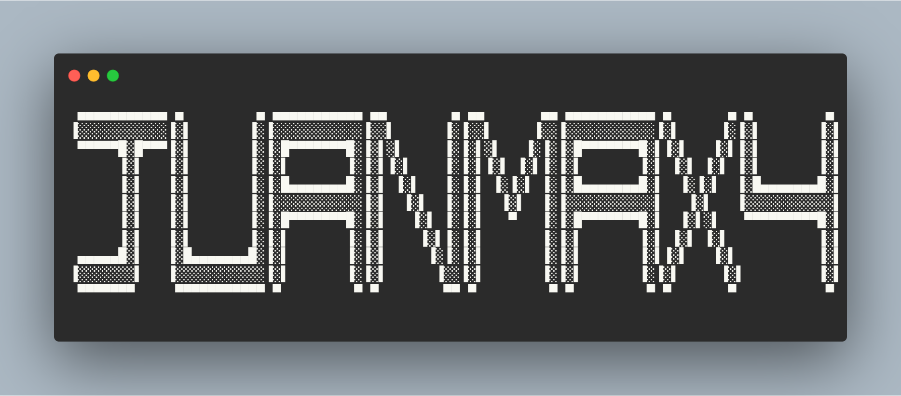

### Hi there 👋 I am...

<h3 align="center">I'm Juanma, a Junior full-stack developer still learning, from Seville now currently I live in Madrid, Spain
</h3>

---

## Development environment 📊

---

## Languages BackEnd 🛠

---
## Languages FrontEnd 🎨

---

## Languages Databases 🛢

## Version Control System ♨️

---

## 📌 Pinned Repositories

~~~
BackEnd Development
~~~

~~~
FrontEnd Development
~~~

---

## Learning more... 📖

---

## All my route in GitHub 🧩

---

<h3 align="left">Connect with me: 🔗</h3>

